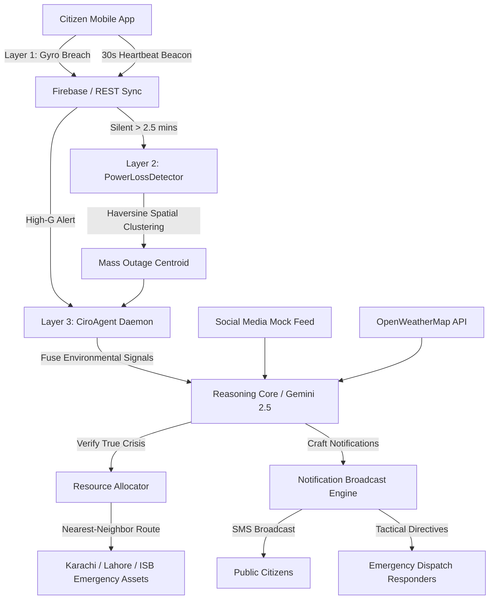

# CIRO — Crisis Intelligence & Response Orchestrator
## AI Seekho 2026 — Challenge 3 | NeuroGrid Labs

CIRO (Crisis Intelligence & Response Orchestrator) is a highly resilient, cognitive multi-layer crisis response platform designed to turn every mobile phone in Pakistan into an active emergency beacon and sensor grid.

---

## Team
* **Muhammad Shumyle Shafiq (Lead)** — Founder, NeuroGrid Labs
* **Muhammad Minhal (Member)** — CA, EY Bahrain

---

## Problem
Pakistan has no unified crisis response system. Signals are scattered across isolated silos—such as active gyroscope anomalies, weather station metrics, traffic grids, and chaotic social media feeds—but no system connects them into coordinated, real-time dispatch action. When critical disasters strike (monsoons, accidents, power grid blackouts), rescue teams respond blind, and municipal systems collapse due to coordinate dilution and response redundancy.

---

## Solution
CIRO introduces a **three-layer crisis intelligence structure** that orchestrates device-level physical telemetry, spatial density clustering, and advanced semantic AI models to verify, locate, and coordinate responses to disasters within seconds:

1. **Layer 1 (The Sensor Edge)**: An ambient client-side background monitor running on citizen devices. It captures high-G gyroscope velocity spikes using low-pass rolling filters and initiates an interactive 10-second circular countdown screen to eliminate false positives before dispatch.
2. **Layer 2 (Spatial Density Clustering)**: A server-side geospatial engine that aggregates silent device heartbeats. It uses Haversine distance equations to cluster network silences within localized regions, flagging infrastructure breakdowns (floods, power grid failures) when multiple nodes collapse simultaneously.
3. **Layer 3 (Cognitive Reasoning Core)**: An AI-powered fusion orchestrator. It merges sensor alerts and spatial blackouts with live weather records and social feeds, using LLM reasoning (Google Gemini 2.5 Flash) to confirm the crisis, plan responder dispatches, and trigger targeted SMS broadcasts.

---

## Architecture



### Technical Detail of the 3 Layers:
* **Layer 1 (Sensor Edge)**: Implemented in React Native using `expo-sensors`. Computes raw angular velocity magnitude $\omega = \sqrt{\omega_x^2 + \omega_y^2 + \omega_z^2}$ at 50ms intervals. To prevent false alarms (e.g. dropped phone on table), it applies a rolling low-pass filter:
  $$\omega_{\text{rolling}} = 0.2 \cdot \omega_{\text{new}} + 0.8 \cdot \omega_{\text{previous}}$$
  If $\omega_{\text{rolling}} > 2.5$ rad/s is sustained for $\ge 150$ms, a 10s countdown modal overlays the UI. If the user does not cancel, the SOS alert is uploaded.
* **Layer 2 (Spatial Density Clustering)**: An active Node.js worker that scans device heartbeats. If a device has not sent a ping for $> 2.5$ minutes, it is marked offline. The `PowerLossDetector` groups offline nodes using Haversine distance computations:
  $$d = 2R \arcsin\left(\sqrt{\sin^2\left(\frac{\Delta\phi}{2}\right) + \cos(\phi_1)\cos(\phi_2)\sin^2\left(\frac{\Delta\lambda}{2}\right)}\right)$$
  If $\ge 3$ nodes are silenced within $1.5$ km and a temporal window of $5$ minutes, a regional mass blackout signal is generated at the centroid coordinate.
* **Layer 3 (Cognitive Reasoning Core)**: Implemented using a dual-mode semantic engine. If a `GEMINI_API_KEY` is present, it formats a prompt with coordinates, local tweets, and weather status, calling Gemini 2.5 Flash to verify the incident. If the API key is absent, it runs an intelligent heuristic rule engine to evaluate risk based on weather traction metrics and social keyphrases.

---

## Live Demo Scenarios
* **Scenario A: Crash detection — Karachi, Gulistan-e-Johar Block 16**
  * *Telemetry*: Gyro magnitude $3.15$ rad/s on dry asphalt.
  * *AI Verification*: Fuses isolated impact with clear skies. Classifies as `ACCIDENT` (Medium Severity).
  * *Resource Allocation*: Maps nearest Karachi hospital (Jinnah Hospital Karachi, Aga Khan Hospital) and dispatches paramedics.
* **Scenario B: Flood — Islamabad, G-10**
  * *Telemetry*: 4 healthy devices in Sector G-10 silenced simultaneously for $> 2.5$ minutes.
  * *AI Verification*: Outage clustered near G-10 grid. Weather details show lightning/thunderstorms. Classifies as `POWER_OUTAGE` (High Severity).
  * *Resource Allocation*: Maps closest Islamabad utility (IESCO Grid Operations Division) and dispatches technical repair crew.
* **Scenario C: Power outage — Lahore, Johar Town**
  * *Telemetry*: 100 devices silenced simultaneously within Johar Town.
  * *AI Verification*: Spatial clustering computes outage centroid at `(31.4806, 74.2812)`. Corroborates with local tweets mentioning power grid explosions. Classifies as `POWER_OUTAGE` (Critical Severity).
  * *Resource Allocation*: Dispatches 3x LESCO Central Utility Division crews to the centroid, avoiding redundant responder calls.

---

## Tech Stack
* **Frontend**: React Native, Expo SDK 54.0.0, TypeScript, Haptics Integration, Animated Circular Components.
* **Backend**: Node.js, TypeScript, Express REST replication layer.
* **Database**: Firebase Realtime Database (with dual-mode fallback to local JSON file stream `mock-db.json` via file locks).
* **AI Engine**: Google Gemini 2.5 Flash (via API) / Local Semantic Parser heuristic core.
* **Geospatial Processing**: Nearest-neighbor Haversine routing algorithms.

---

## Antigravity Usage
The codebase was developed under a pair-programming setup with **Antigravity**, Google Deepmind's powerful agentic AI coding assistant. Antigravity:
1. Designed and implemented the complete low-pass gyroscope filtering and sustained shock algorithm.
2. Structured the geographic-temporal Haversine clustering engine for Layer 2.
3. Created the dual-mode API switchers allowing seamless compilation of standalone APKs.
4. Resolved compilation and dependency version conflicts within the Expo SDK 54 Android build environment.

---

## APIs Used
* **Google Gemini API**: Fuses environmental sensor data with social/weather reports for cognitive disaster verification.
* **OpenWeatherMap API**: Provides real-time weather metrics (rain volume, wind speed, precipitation) to evaluate environmental road/grip traction and storm severity.
* **Expo Location API**: Fetches sub-meter GPS coordinates of mobile nodes.

---

## Setup Instructions

### Backend Setup:
```bash
cd backend
npm install
npm run start
```
*To run the E2E Master Simulation:*
```bash
npm run simulate
```

### Mobile App Setup:
```bash
cd mobile-app
npm install
npx expo start
```

---

## Cost Analysis
* **Google Gemini 2.5 Flash**:
  * Input tokens per transaction: ~800 tokens. Cost: \$0.000075.
  * Output tokens: ~150 tokens. Cost: \$0.00045.
  * *Total Reasoning Cost*: **\$0.000525 per emergency event**.
* **OpenWeatherMap API**: Free tier allows 1,000 calls per day; \$0.0015 per call thereafter.
* **Firebase Realtime Database**: Covered fully by the free Spark Plan (up to 100 concurrent connections, 10GB data transfer).

---

## Scalability
* **Low Network Footprint**: Heartbeat payloads are restricted to just 48 bytes (lat, lon, ts, active) transmitted every 30 seconds.
* **Stateless Backend Daemons**: Background active listeners are fully stateless, enabling scaling via Kubernetes pods and load balancing across multi-region Firebase clusters.
* **Responder Dispatch Clamping**: Layer 2 aggregates and clamps massive localized outages into a singular centroid, preventing downstream emergency networks from flooding.

---

## Phase 2 — Anti-Theft Mode (Future Scope)
In Phase 2, CIRO will roll out an **Anti-Theft Security Shield**:
* **Acoustic / Haptic Patterns**: Uses on-device micro-sensors to detect snatching profiles (abrupt linear acceleration spikes paired with a total network loss).
* **Silent Local Lock**: Activates local encrypted storage locks, wipes memory caches, and beacons cell tower coordinates using low-power SMS channels if mobile data is terminated.

---

## Limitations
* **GPS Deprivation**: Inside dense concrete structures or basements, GPS coordinates default to cellular tower triangulation which increases the error radius.
* **Offline REST bounds**: In full offline scenarios, local replication syncs to an Express endpoint, which requires localized LAN or private mesh-radio configurations to aggregate nodes.
* **False Recalls**: If a victim is rendered unconscious and falls onto the "Cancel Emergency" button, the dispatch is delayed until heartbeats are silenced.
